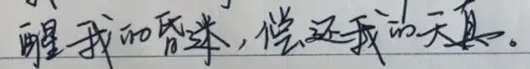

# 基于trocr(beit+roberta)实现对中文场景文字识别
trocr原地址(https://github.com/microsoft/unilm/tree/master/trocr)
## 实现功能
- [x]  单行/多行文字/横竖排文字识别
- [x]  不规则文字（印章，公式等）
- [x]  转 onnx模型
- [ ]  表格识别
- [ ]  模型蒸馏/DML(协作学习)
- [ ]  Prompt Learning

## 环境编译
```
docker build --network=host -t trocr-chinese:latest .
docker run --gpus all -it -v /tmp/trocr-chinese:/trocr-chinese trocr-chinese:latest bash

```
## 训练
### 初始化模型到自定义训练数据集
#### 字符集准备参考cust-data/vocab.txt
```
vocab.txt
1
2
...
a
b
c
```
```[python]
python gen_vocab.py \
       --dataset_path "dataset/cust-data/0/*.txt" \
       --cust_vocab ./cust-data/vocab.txt

```
### 初始化自定义数据集模型
#### 下载预训练模型trocr模型权重
链接: https://pan.baidu.com/s/1rARdfadQlQGKGHa3de82BA  密码: 0o65.  
google driver: https://drive.google.com/drive/folders/1ibOVCHu33asiMUaFT9FzvhFNM4z25cJY?usp=share_link  
```
python init_custdata_model.py \   
    --cust_vocab ./cust-data/vocab.txt \  
    --pretrain_model ./weights \
    --cust_data_init_weights_path ./cust-data/weights
    
## cust_vocab 词库文件   
## pretrain_model 预训练模型权重   
## cust_data_init_weights_path 自定义模型初始化模型权重保存位置   

```

### 训练模型
#### 数据准备,数据结构如下图所示
```
dataset/cust-data/0/0.jpg
dataset/cust-data/0/0.txt
...
dataset/cust-data/100/10000.jpg
dataset/cust-data/100/10000.txt
```

#### 训练模型
```
python train.py \
       --cut_data_init_weights_path ./cust-data/weights \
       --checkpoint_path ./checkpoint/trocr-custdata \
       --dataset_path "./dataset/cust-data/*/*.jpg" \
       --per_device_train_batch_size 8 \
       --CUDA_VISIBLE_DEVICES 1
```

#### 评估模型
##### 拷贝checkpoint/trocr-custdata训练完成的pytorch_model.bin 到 ./cust-data/weights 目录下

```[python]
python eval.py \
    --dataset_path "./data/cust-data/test/*/*.jpg" \
    --cust_data_init_weights_path ./cust-data/weights    
```

## 测试模型
```
## 拷贝训练完成的pytorch_model.bin 到 ./cust-data/weights 目录下
index = 2300 ##选择最好的或者最后一个step模型
cp ./checkpoint/trocr-custdata/checkpoint-$index/pytorch_model.bin ./cust-data/weights
python app.py --cust_data_init_weights_path ./cust-data/weights --test_img test/test.jpg
```
## 转onnx 
```shell
python -m \
    transformers.onnx \
    hand-write \
    --feature=vision2seq-lm \
    hand-write-onnx --atol 1e-4

cp hand-write/vocab.json hand-write-onnx/

python onnx_test.py --model hand-write-onnx --test_img ./img/hand.png

```

## 预训练模型
| 模型        | cer(字符错误率)           | acc(文本行)  | 下载地址  |训练数据来源 |训练耗时(GPU:3090) | 
| ------------- |:-------------:| -----:|-----:|-----:|-----:|
| hand-write(中文手写)      |0.011 | 0.940 |[hand-write](https://pan.baidu.com/s/19f7iu9tLHkcT_zpi3UfqLQ)  密码: punl |[数据集地址](https://aistudio.baidu.com/aistudio/datasetdetail/102884/0) |8.5h(10epoch)|
| seal-ocr(印章识别)      |0.006 | 0.956 | 整理后开放下载|- |
| im2latex(数学公式识别)      |- | - |- |[im2latex](https://zenodo.org/record/56198#.YkniL25Bx_S) ||
| TAL_OCR_TABLE(表格识别)     |- | - |- |[TAL_OCR_TABLE](https://ai.100tal.com/dataset) |
| TAL_OCR_MATH(小学低年级算式数据集)|- | - |- | [TAL_OCR_MATH](https://ai.100tal.com/dataset) |
| TAL_OCR_CHN(手写中文数据集)|0.0455 | 0.674（标注质量不太高,例如：test_64/552.jpg 标注值:蝶恋花, 实际值:欧阳修  ） |[TAL_OCR_CHN](https://pan.baidu.com/s/1GbyVpbiKyVN1nJipvH2fpA)  密码: 9kd8 | [TAL_OCR_CHN](https://ai.100tal.com/dataset) |0.6h(20epoch)|
| HME100K(手写公式)|- | - |- | [HME100K](https://ai.100tal.com/dataset) |

备注:后续所有模型会开源在这个目录下链接,可以自由下载. https://pan.baidu.com/s/1uSdWQhJPEy2CYoEULoOhRA  密码: vwi2
### 模型调用 
#### 手写识别

```
unzip hand-write.zip 
python app.py --cust_data_init_weights_path hand-write --test_img test/hand.png

## output: '醒我的昏迷,偿还我的天真。'
```

## 训练技巧
###### 数据集较少时，可以采用数据增强的方法构造更多的数据，理论上几十万的数据（可不做数据增强，模型预训练已经见到过足够多的数据(票据类、证件类，打印、手写、拍照等场景)），可以收敛到90%以上的准确率（CER<0.05）   
###### 训练样本不要自己resize到384x384（后续会优化这个结构，目前预训练是384x384），保留原图即可，模型前处理processor会自动处理    
###### 如果要训练识别多行文字，文字行之间可以加一个特殊字符标记，例如："1234\n4567\n89990"   
###### fine-tune中英文以外的语言效果可能不太好（足够多的数据及足够steps也能收敛），因为没有在其他语言上预训练    
###### 遇到问题先分析一下自己的数据，然后增加一些训练的技巧去优化，不要指望模型解决100%的问题
###### 本项目采用的encoder-decoder结构, 模型还是比较大，如果上生产对硬件开销大，也可以优化encoder（比如cnn结构的mobilenet，resnet）或者decoder（roberta-tiny），然后对其进行蒸馏
###### 如果此项目不能解决您的问题，请选择其他项目，不要因为此项目影响自己的心情！！！

